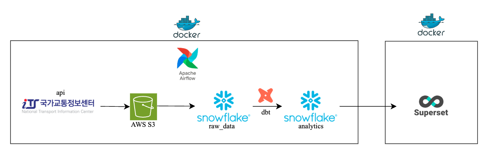
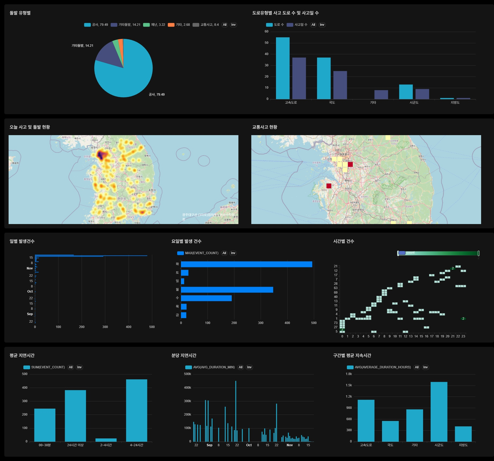

# 프로젝트 소개
- 주제 </br>
  - 전국 실시간 교통정보(돌발 상황: 사고, 고장, 공사 등) 데이터를 수집, 정제, 통합하여 
신속하고 직관적인 의사 결정을 지원하는 대시보드
- 목표 </br>
  - 실시간 데이터 통합: 분산된 돌발 정보를 단일 플랫폼(Snowflake)으로 통합.
  - 데이터 품질 확보: dbt를 활용하여 데이터 정합성 및 분석 가능한 형태로 구조화.
  - 시각화 제공: Superset을 통해 현황을 실시간으로 모니터링할 수 있는 대시보드 제공.
 
- 팀 구성 및 역할
  
| 팀원 | 역할 |
| --- | --- |
| 김지연 👑 | Snowflake 권한 관리, 테이블 설계, 데이터 분석 및 시각화 |
| 최수진 | GitHub 관리, 버전관리, 데이터 분석 및 시각화 |
| 배지환 | Superset 차트 통합 및 관리, 대시보드 개발, 데이터 분석 및 시각화 |
| 이원배 | AWS 인프라 (IAM 권한 생성/부여), S3 버킷 구성, 데이터 분석 및 시각화 |

# 프로젝트 구현

## 기술스택
| 구분          | 기술 스택                 | 주요 활용 목적                     |
| ----------- | --------------------- | ---------------------------- |
| 워크플로우       | Apache Airflow        | 데이터 파이프라인 자동화 및 스케줄링         |
| 데이터 웨어하우스   | Snowflake             | 대용량 데이터 통합 저장 및 고성능 분석       |
| 클라우드 스토리지   | AWS S3                | 원천 데이터(CSV 등) 안전한 저장         |
| 데이터 변환(ELT) | dbt (Data Build Tool) | Snowflake 기반 SQL 모델링 및 변환    |
| 시각화/대시보드    | Apache Superset       | 실시간 데이터 시각화 및 대시보드 구축        |
| 협업/문서/버전관리  | Slack, Notion, GitHub | 커뮤니케이션, 문서화, 이슈 관리, 코드 버전 관리 |


## 프로젝트 구조
```
[API 수집]
        ↓
(Airflow + Python)
        ↓
[S3 Raw Zone 저장]
        ↓
[Snowflake Stage / Transform]
        ↓
[Analytics Table / dbt Modeling]
        ↓
[Superset Dashboard]
```
<!--  -->



## 디렉토리 구조
```
traffic-404/
├── airflow/                                  # Airflow 워크플로우 관련 폴더
│   ├── dags/                                 # DAG 스크립트들이 위치하는 디렉토리
│   │   ├── jihwan/                           # 지환님 Airflow DAG 모음
│   │   │   └── ingest_its_event_dag.py
│   │   ├── jiyeon/                           # 지연님 Airflow DAG 모음
│   │   │   ├── delete_local.py
│   │   │   ├── upload_api_to_snowflake.py
│   │   │   └── upload_to_s3.py
│   │   ├── soojin/                           # 수진님 Airflow DAG 모음
│   │   │   ├── traffic_csv.py
│   │   │   └── traffic_parquet.py
│   │   └── wonbae/                           # 원배님 Airflow DAG 모음
│   │       └── traffic.py
│   ├── config/
│   ├── data/
│   ├── logs/
│   ├── plugins/
│   └── docker-compose.yaml
│
├── dbt/                                      # dbt 모델링 작업 폴더
│   ├── dbt_project.yml
│   └── traffic/
│       ├── models-jiyeon/                    # 지연님 dbt 모델 집합
│       │   ├── marts/
│       │   │   └── traffic_by_road_type.sql
│       │   └── src/
│       │       └── src_traffic_events.sql
│       │
│       ├── models-jihwan/                    # 지환님 dbt 모델 집합
│       │   ├── marts/
│       │   │   └── event_type_summary.sql
│       │   └── staging/
│       │       └── stg_event_info.sql
│       │
│       ├── models-soojin/                    # 수진님 dbt 모델 집합
│       │   └── marts/
│       │       ├── daily_event_count.sql
│       │       ├── daily_event_count.yml
│       │       ├── hourly_event_heatmap.sql
│       │       └── weekday_event_count.sql
│       │
│       └── models-wonbae/                    # 원배님 dbt 모델 집합
│           ├── avg-duration-min.sql
│           ├── duration-avg.sql
│           ├── duration-hours.sql
│           ├── duration-min.sql
│           ├── eventtype-avg.sql
│           └── eventtype.sql
│
├── LICENSE
└── README.md

```

## 시각화 화면
<!--  -->



